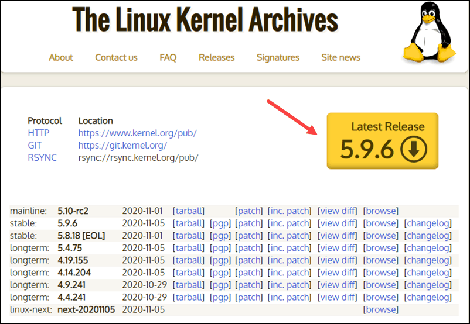
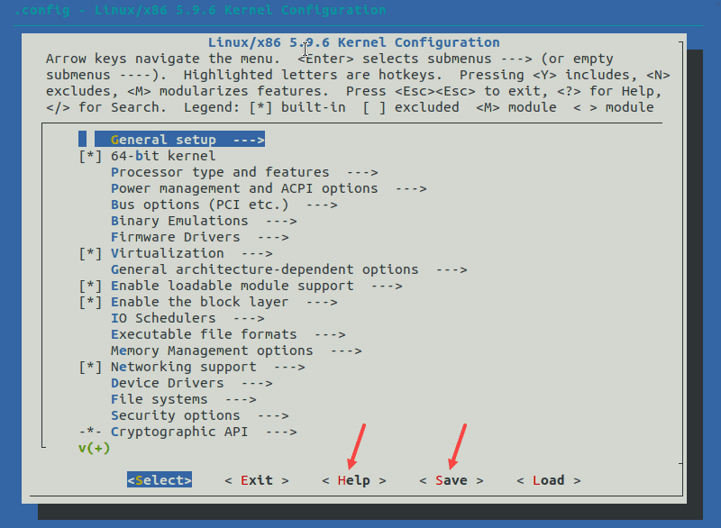

## Kernel

### Step 1: Download the Source Code

1. Visit the official [kernel website](https://www.kernel.org/) and download the [latest kernel version](https://phoenixnap.com/kb/check-linux-kernel-version). The downloaded file contains a compressed source code.



2. Open the terminal and use the wget command to download the Linux kernel source code:

```bash
wget https://cdn.kernel.org/pub/linux/kernel/v5.x/linux-5.9.6.tar.xz
```

### Step 2: Extract the Source Code

```bash
tar xvf linux-5.9.6.tar.xz
```

### Step 3: Install Required Packages

```bash
sudo apt-get install git fakeroot build-essential ncurses-dev xz-utils libssl-dev bc flex libelf-dev bison
```

### Step 4: Configure Kernel
The Linux kernel source code comes with the default configuration. However, you can adjust it to your needs. To do so, follow the steps below:

```bash
cd linux-5.9.6
cp /boot/config-... .config
make menuconfig
```
The configuration menu includes options such as firmware, file system, network, and memory settings. Use the arrows to make a selection or choose HELP to learn more about the options. When you finish making the changes, select SAVE, and then exit the menu.



---

Note: Changing settings for some options can lead to a non-functional kernel. If you are unsure what to change, leave the default settings.

---

### Step 5: Build the Kernel

```bash
make
```

The process of building and compiling the Linux kernel takes some time to complete.

The terminal lists all Linux kernel components: memory management, hardware device drivers, filesystem drivers, network drivers, and process management.

Install the required modules with this command:

```bash
sudo make modules_install
```


links:
* https://phoenixnap.com/kb/build-linux-kernel
* https://www.manualslib.com/manual/1427367/Corewind-Technology-Sbc-Sam9g20.html?page=21
